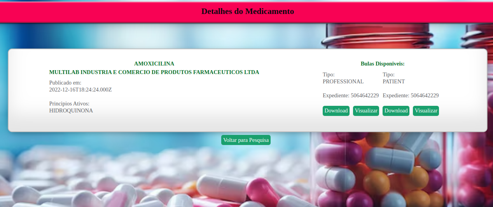

<div align="center">

# Project Bulario Dot Lib
[](https://www.dotlib.com)

</div>

Este Projeto e a resolução de um desafio tecnico proposto pela [Dot Lib](https://www.dotlib.com/), o desafio consiste em criar uma uma interface frontend para um sistema de gerenciamento de bulas de medicamentos, e possivel visualizar os medicamentos, pesquisar por nome e laboratorio, alem de uma pagina com detalhes de um medicamento e links para downloads das bulas. Desenvolvi este projeto utilizando Vite, React, Typescript, Css e consumindo uma API.

<p align="center">
  
  
</p>

## Tecnologias Utilizadas

 [Node JS](https://nodejs.org/en/docs)

 [JavaScript](https://developer.mozilla.org/pt-BR/docs/Web/JavaScript)

 [TypeScript](https://www.typescriptlang.org/)

 [React](https://pt-br.reactjs.org/)

 [CSS](https://developer.mozilla.org/pt-BR/docs/Web/CSS)

 [Vitest](https://vitejs.dev/)

 [Vite](https://vitejs.dev/)

 [Jest](https://jestjs.io/pt-BR/docs/getting-started)

## Índice

- [Ambiente de Desenvolvimento](#requisitos)
- [Instalação](#instalação)
- [Uso](#uso)
- [Estrutura do Projeto](#estrutura-do-projeto)
- [Contato](#contato)
- [Licença](#licença)

## Ambiente de Desenvolvimento

Para desenvolver e executar esta aplicação, é necessário configurar um ambiente com as seguintes ferramentas:

**Node.js**: A aplicação é desenvolvida em Node.js, uma plataforma de tempo de execução JavaScript, e é necessária para executar o código.

   - [Instalação do Node.js](https://nodejs.org/pt-br/download/)

Certifique-se de instalar e configurar essas ferramentas em seu ambiente de desenvolvimento antes de iniciar o projeto.

## Instalação

Clone este repositório:

   ```bash
   git clone git@github.com:ElieltonRamos/teste-desenvolvedor-frontend.git
   ```

Navegue até o diretório do projeto:

   ```bash
cd teste-desenvolvedor-frontend
   ```

Inicie a API:

   ``` bash
   npx json-server api/dotlib.json -s ./api/public
   ```

Em outro terminal Instale as dependências:

   ``` bash
cd frontend-bulario && npm install
   ```

Inicie o servidor de desenvolvimento:

   ``` bash
npm run dev
   ```

## Testes

O projeto conta com testes que verificam o funcionamento do frontend, existem testes para verificar se a aplicação esta renderizando corretamente, se a busca por medicamentos esta funcionando, se a pagina de detalhes de um medicamento esta funcionando e se os links para download das bulas estão funcionando.

Para executar os testes siga os seguintes passos:

Abra o terminal na raiz do projeto

Execute o comando:

   ``` bash
cd frontend-bulario && npm test
   ```

Verifique a saida dos testes no seu terminal

## Uso

Para utilizar a aplicação, acesse o endereço [http://localhost:5173](http://localhost:5173) em seu navegador.

A aplicação exibe uma lista de medicamentos, com opções de pesquisa por nome e laboratório. Clique em um medicamento para ver detalhes e links para download das bulas.
A aplicação também conta com um botão de voltar para a pagina inicial.
A aplicação é responsiva e se adapta a diferentes tamanhos de tela.
A aplicação conta com testes que verificam o funcionamento do frontend.

## Estrutura do Projeto

A seguir esta explicada a estrutura de pastas do projeto

project-api-talker-manager/ : A pasta raiz do projeto.<br>
├── api/ : Pasta com os arquivos da API.<br>
│   ├── public/ : Pasta com os arquivos estáticos da API.<br>
│   ├── dotlin.json : Arquivo com os dados dos medicamentos.<br>
├── frontend-bulario/ : Pasta com os arquivos do frontend.<br>
├── public/ : Pasta imagens do readme.<br>
├── README.md : Arquivo com a documentação do projeto.<br>
├── .github/ : Pasta com arquivos de configuração do GitHub.<br>

## Contato

Elielton Ramos

[](mailto:elieltonramos14@gmail.com)
[](https://www.linkedin.com/in/elielton-ramos/)

## Licença

Código Aberto (Open Source)

Este projeto é de código aberto e está disponível para toda a comunidade. Fique à vontade para explorar, clonar e contribuir para o projeto.

## Agradecimentos

Agradeço a [Dot Lib](https://www.dotlib.com/) pela oportunidade de participar do processo seletivo e desenvolver este projeto.